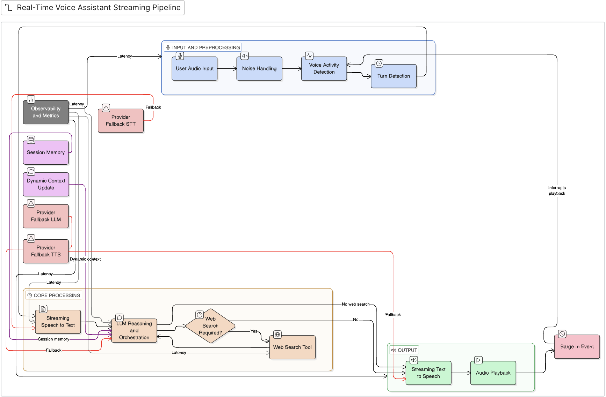

# Voice Agent – Engineering Assignment 1

A production-ready, low-latency, real-time voice assistant capable of natural, interruptible conversations with multiple concurrent users. The system is built with a strong focus on latency, robustness, observability, and engineering judgment, closely mirroring real-world voice AI systems.

---

## Project Overview

This project implements a cascaded, streaming voice pipeline that allows users to talk to an AI agent as naturally as they would to a human. The agent supports:

- Real-time speech recognition
- Natural turn-taking and barge-in (interruptions)
- Dynamic context updates during an active conversation
- Real-time web search for current information
- Session-scoped conversation memory
- Multi-user concurrent sessions
- End-to-end observability with detailed metrics
- Provider fallback for resilience

The system is designed to degrade gracefully, remain responsive under load, and expose internal performance characteristics clearly.

---

## Voice Pipeline Architecture

```
User Audio
   ↓
Noise Handling (lightweight)
   ↓
Custom VAD (Voice Activity Detection)
   ↓
Turn Detection (state-machine + grace period)
   ↓
Streaming STT (Deepgram)
   ↓
LLM Reasoning + Tools (Groq + Web Search)
   ↓
Streaming TTS (Deepgram)
   ↓
Audio Playback (with barge-in support)
```

Each stage is isolated, observable, and instrumented for latency and correctness.



---

## Architecture Overview

### Backend (Node.js)
- WebSocket-based server for low-latency, bidirectional audio and control messages
- Session Manager to isolate users and prevent context bleed
- State-machine driven turn detection (speech_start → speech_end)
- Streaming integrations for STT and TTS
- LLM orchestration layer with tool invocation and fallback logic

### Frontend (React)
- Real-time microphone capture
- Visual agent avatar with speaking/listening/thinking states
- Live transcripts for both user and assistant
- Left-hand metrics sidebar for per-turn observability

---

##  Custom Audio Processing

### Voice Activity Detection (VAD)
- Implemented using energy-based heuristics on raw PCM audio
- Converts Int16 PCM → Float32 for accurate signal processing
- Tuned thresholds to balance responsiveness and false positives

### Turn Detection
- Driven by a VAD-gated state machine
- Includes a grace period to avoid cutting off trailing phonemes
- Prevents transcript fragmentation and improves STT accuracy

---

##  Speech-to-Text (STT)
- Primary Provider: Deepgram (Streaming WebSocket)
- Always-on STT connection to eliminate startup latency
- Interim transcripts are replaced, final transcripts are appended
- Downstream logic runs only on final transcripts

### STT Stability Improvements
- Turn-final buffering (no partial-word commits)
- Transcript cleaning to drop spurious/short fragments
- Downstream logic runs only on final transcripts

### STT Resilience
- Always-on Deepgram socket, re-created per session
- Connection/parse errors are caught and logged with the `sessionId`
- A turn-end heartbeat flushes the turn if audio goes silent without a VAD `speech_end`

---

## LLM Processing
- Provider: Groq (fast inference, `llama-3.3-70b-versatile`)
- Two-call flow per turn: a search-decision call, then a grounded-response call

### Features
- Session-scoped conversation memory (bounded sliding window of the last 12 messages)
- Intent-gated web search (decision call + explicit keyword gate)
- Prompting optimized for spoken, human-like responses (not bullet points)
- Numerical and temperature responses formatted for natural speech

### LLM Resilience
- Errors (rate limits, timeouts, network failures) are caught per turn
- On failure the user hears a short apology and the UI resets to idle — it never hangs on "thinking"

---

## Web Search Integration
- Provider: Tavily Search API
- Intent-gated search (only triggers for time-sensitive / external queries)
- Search results are:
  - Injected ephemerally into the prompt
  - Never stored in long-term conversation memory
  - Sources are cited in responses

---

## Text-to-Speech (TTS)
- Primary Provider: Deepgram TTS (streaming)
- Audio streamed in browser-compatible format
- Frontend uses a dedicated playback AudioContext

### Barge-In Support
- User can interrupt the assistant mid-speech
- TTS stream is immediately cancelled
- Playback buffer cleared
- New user speech is captured without delay

### TTS Resilience
- Per-sentence synthesis with automatic retry and exponential backoff (up to 3 attempts)
- Keep-alive HTTPS agent and per-request timeouts to avoid socket hang-ups
- Request-ID guarding so audio from a barged-in turn is never played

---

## Real-Time Context Updates
- Context can be injected into an active session via WebSocket
- Used for:
  - Changing assistant persona
  - Applying admin instructions
- Context updates:
  - Are session-scoped
  - Do not pollute conversation memory
  - Apply immediately to subsequent responses

---

## Multi-User Architecture
- Each WebSocket connection maps to an isolated session
- No shared mutable state between sessions
- Designed to scale horizontally

### Scalability Notes
- 10–100 concurrent users: Single Node.js instance
- 1000+ users: Horizontal scaling with:
  - Stateless WebSocket gateways
  - External session store (e.g., Redis)
  - Provider-side scaling for STT/LLM/TTS

---

## Observability & Metrics Dashboard

For every conversation turn, the system records:
- VAD detection timestamps
- STT latency
- LLM latency (including TTFT)
- TTS latency
- End-to-end turn latency
- Search triggered / skipped
- Provider fallback indicators

Metrics are displayed live in the UI sidebar and logged structurally.

---

## Logging
- Stage-tagged console logs (e.g. `[STT]`, `[SEARCH]`, `[LLM RESPONSE]`, `[TTS]`)
- Most log lines include the `sessionId`, and turn metrics carry a `turnId`
- This makes it possible to follow a single user utterance through the pipeline in the logs

> Note: logs are human-readable tagged lines, not JSON. Structured JSON logging is a candidate future improvement.

---

## Conversation Memory
- Session-scoped, bounded memory
- Last N messages sent to the LLM
- Prevents token explosion while preserving context

### Future Extensions
- Redis-backed persistence
- Long-term summarization

---

## Testing & Verification
- Unit/integration scripts under `backend/utils/` (VAD, memory bounding, search gating, STT stability)
  — run a couple via `npm test` in `backend/`
- Manual testing with multiple concurrent browser tabs (verifies session isolation)
- The token-protected admin API (`POST /admin/context`) for live, session-targeted context injection

---

## Tradeoffs, Iterations & Design Decisions

This project went through multiple iterations while solving real, production-style problems. Below is a transparent account of what didn't work initially, why changes were made, and the final tradeoffs.

### 1. STT Stability vs Latency

**Initial approach:**
- Triggered STT transcription aggressively on short silences
- Processed partial transcripts immediately

**Problems encountered:**
- Broken words (e.g., "Pun" instead of "Pune")
- Truncated entities and phonemes
- Over-reliance on transcript normalization hacks

**Final decision:**
- Move to turn-final transcription only
- Introduce a grace period after silence detection
- Always-on STT socket to avoid startup delays

**Tradeoff:**
- Slightly higher end-of-turn latency
- Significantly higher transcript accuracy and naturalness

---

### 2. WAV / MP3 Streaming vs Raw PCM Playback

**Initial approach:**
- Stream raw PCM (Linear16) audio
- Manually convert Int16 → Float32 → AudioBuffer in frontend

**Problems encountered:**
- Skipped words
- Partial audio playback
- Decode failures due to missing headers

**Final decision:**
- Streaming WAV from TTS provider
- Decoding each chunk individually in the browser

**Tradeoff:**
- More frontend audio logic
- Deterministic, glitch-free playback with no skipped speech

---

### 3. Tool-Based LLM Search vs Prompt-Based Intent Gating

**Initial approach:**
- Native LLM tool-calling for web search

**Problems encountered:**
- Tool call failures
- Over-triggering on generic queries
- Poor debuggability

**Final decision:**
- Explicit intent-gating logic
- Two-step LLM flow: decision → grounded response

**Tradeoff:**
- Slightly more orchestration code
- Full control, predictability, and clean logs

---

### 4. Barge-In Complexity vs System Stability

**Initial approach:**
- Attempted to handle barge-in and audio correctness together

**Problems encountered:**
- Race conditions
- Inconsistent TTS cancellation
- Unreliable UX

**Final decision:**
- First stabilize audio correctness
- Re-introduce barge-in with:
  - request IDs
  - atomic TTS cancellation
  - buffer clearing

**Tradeoff:**
- Longer implementation time
- Clean, reliable interruption behavior

---

### 5. Provider Choice & Resilience Strategy

**Approach:**
- One focused provider per capability: Deepgram (STT + TTS), Groq (LLM), Tavily (search)

**Problems encountered:**
- Transient timeouts and socket hang-ups, especially on TTS during rapid barge-in

**Final decision:**
- Per-request timeouts, retry with exponential backoff (TTS), and a keep-alive HTTPS agent
- Every stage catches its own errors; a failed turn resets the UI to idle instead of hanging

**Tradeoff:**
- No automatic cross-provider failover (a hard provider outage degrades that capability)
- In exchange: far simpler, more debuggable orchestration and fewer moving parts

> Multi-provider failover (e.g. a second STT/TTS/LLM vendor) was intentionally scoped out to
> keep the pipeline simple and honest. It's a natural extension behind the existing service
> interfaces if higher availability is needed.

---

### 6. What Was Deferred Intentionally
- Heavy DSP-based noise suppression
- Persistent long-term memory
- Authentication & access control

These were deferred to keep the focus on core voice interaction quality, latency, and robustness.

This iterative process reflects real-world engineering tradeoffs rather than idealized designs.

---

## Future Work
- Advanced noise suppression
- Semantic caching for repeated queries
- Full deployment with autoscaling

---

##  Setup Instructions

### Prerequisites
- Node.js (v18+ recommended)
- Modern browser (Chrome preferred)
- API keys: Deepgram, Groq, Tavily

### 1. Backend

```bash
cd backend
npm install
cp .env.example .env   # then fill in your keys
npm start              # serves HTTP + WebSocket on :8080
```

Required environment variables (see `backend/.env.example` for the full list):

```
DEEPGRAM_API_KEY=      # STT + TTS
GROQ_API_KEY=          # LLM
TAVILY_API_KEY=        # web search
```

Optional (recommended for production):

```
ALLOWED_ORIGINS=       # comma-separated allowed browser origins ("*" = dev only)
ADMIN_TOKEN=           # shared secret for POST /admin/context (disabled if unset)
SELF_PING_URL=         # public /health URL for free-tier keep-alive
PORT=                  # injected by the host; defaults to 8080 locally
```

### 2. Frontend

```bash
cd voice-ui
npm install
cp .env.example .env.local   # defaults to ws://localhost:8080
npm run dev                  # http://localhost:3000
```

Set `NEXT_PUBLIC_WS_URL` to point the UI at the backend (defaults to `ws://localhost:8080`).

Open http://localhost:3000, click to grant microphone access, and start talking.

---

## Deployment

The backend (long-lived WebSocket server) and frontend (Next.js) deploy separately:

- **Backend → Render** (a `render.yaml` Blueprint is included at the repo root)
- **Frontend → Vercel**

See **[DEPLOYMENT.md](./DEPLOYMENT.md)** for complete, step-by-step instructions including
environment variables, CORS/origin wiring, and end-to-end verification.

---

## Demo

A 3–4 minute demo video showcasing:
- Natural voice conversation
- Web search
- Barge-in
- Real-time context update
- Metrics dashboard

(Link provided in submission email)

---

## Final Notes

This project is built as a realistic product system, not a toy demo. The emphasis is on correctness, resilience, and clarity of engineering decisions.

Thank you for reviewing!